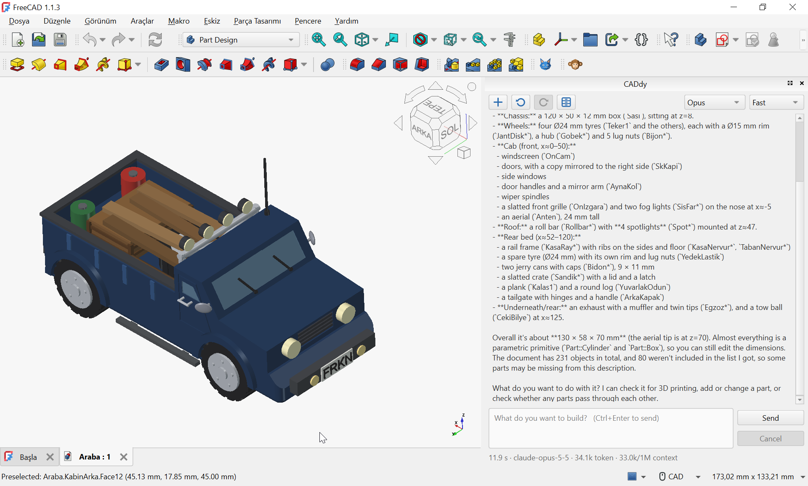
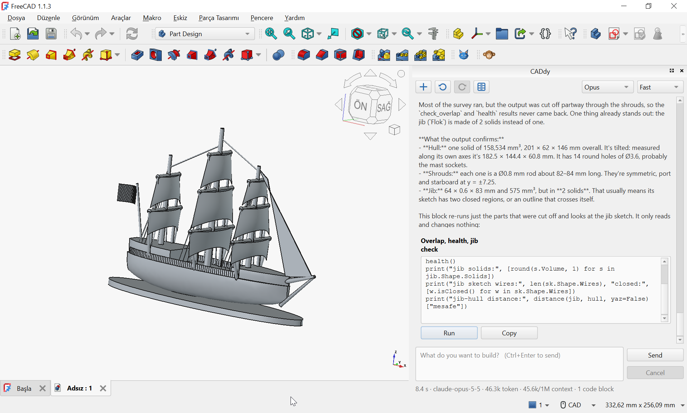
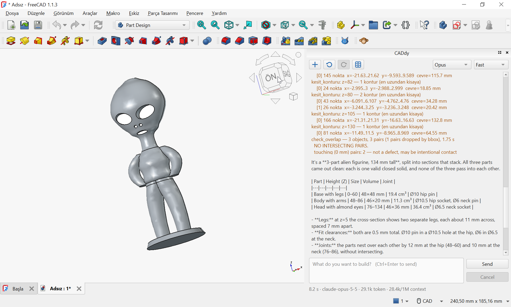
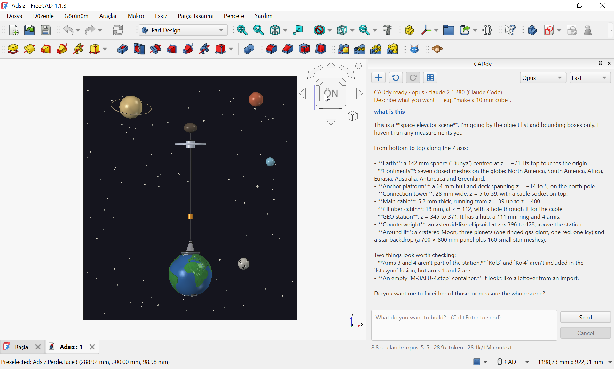
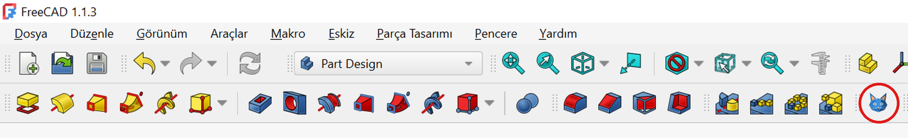

# CADdy

**An AI assistant that lives inside FreeCAD — and measures its work instead of guessing.**

https://github.com/user-attachments/assets/2cfa3f8e-b67b-40ed-ae7c-c576d6d24644

You draw. You ask. CADdy continues on the same live document. You keep going.
Nothing is exported, nothing is lost, and every AI step is one `Ctrl+Z` away.

---

## Why CADdy

- **Verified, not eyeballed.** After every change CADdy checks the geometry:
  overlapping parts, open shells, invalid solids, volumes. An AI looking at a
  screenshot says "looks fine" — CADdy measures.
- **One live document.** Hand-made and AI-made features sit in the same model
  tree and stay parametric. Edit either one, any time.
- **One step, one undo.** However many objects an AI turn creates, a single
  `Ctrl+Z` rolls it back.
- **Runs on your Claude subscription.** It drives the official Claude Code
  CLI, so there is no separate API key to manage. Usage is drawn from your
  plan's monthly Agent SDK credit (e.g. $20 on Pro); beyond that, standard
  API rates apply.

| | |
|---|---|
|  |  |
| *A toy pickup truck, built step by step in one live document.* | *A sailing ship: measured part by part, not eyeballed.* |
|  |  |
| *A 3-part printable figurine, checked for overlaps and fit.* | *A space elevator concept (below).* |

*Not only parts — ideas too. A visual concept of a space elevator: a cable anchored on Earth's north pole, a climber cabin on its way up, a station in geostationary orbit and a counterweight beyond it, with the Moon, planets and a starfield around them. Asked "what is this", CADdy reads the scene back from the document itself — every part, its size and where it sits.*

## Requirements

- Windows 10 / 11
- [FreeCAD 1.1](https://www.freecad.org/downloads.php) (1.0 and older will not work)
- [Claude Code CLI](https://docs.anthropic.com/en/docs/claude-code), signed in with a Claude Pro or Max plan

> If `ANTHROPIC_API_KEY` is set, the CLI bills that API key instead of your
> subscription. Unset it unless that is what you want.

## Install

```powershell
git clone https://github.com/furkanbulus123/CADdy.git
cd CADdy
.\install.ps1
```

The script finds FreeCAD, checks the `claude` command and links the folder into
FreeCAD's `Mod` directory. No admin rights needed. Restart FreeCAD and pick
**CADdy** from the workbench list.

## Usage

Click the cat icon in the toolbar to open the CADdy panel. It stays in the
toolbar in every workbench:



Then describe what you want:

> *"Add four M3 mounting holes, 5 mm from each corner."*

| Button | What it does |
|---|---|
| **New** | Start a fresh conversation |
| **Undo / Redo** | Step through AI changes |
| **Model** | Opus or Sonnet |
| **History** | Resume a past chat |
| **Fast / Deep** | How much the model thinks |

## Tests & architecture

See [ARCHITECTURE.md](ARCHITECTURE.md).

```powershell
& "C:\Program Files\FreeCAD 1.1\bin\freecadcmd.exe" tests\test_yukleme_fc.py
```

## License

[MIT](LICENSE)
